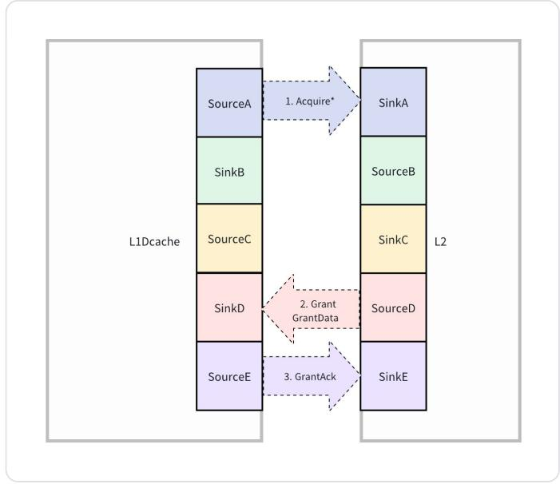
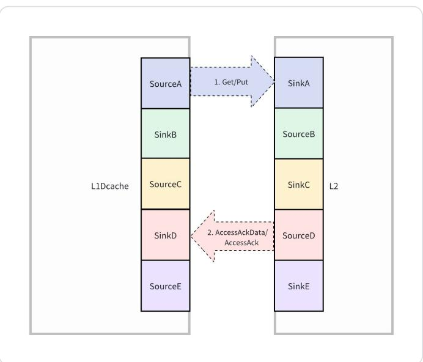
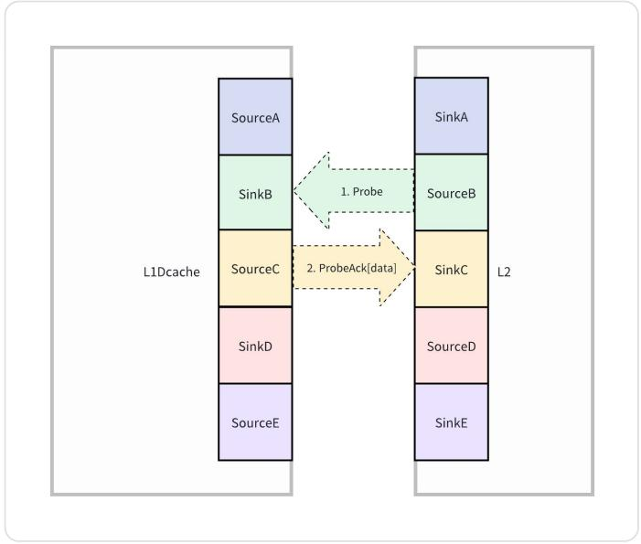
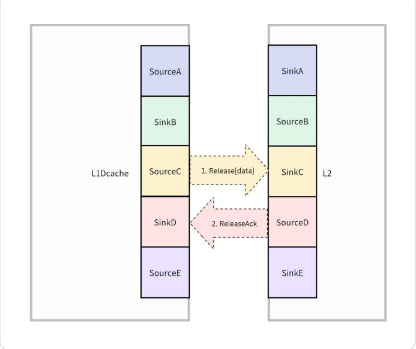
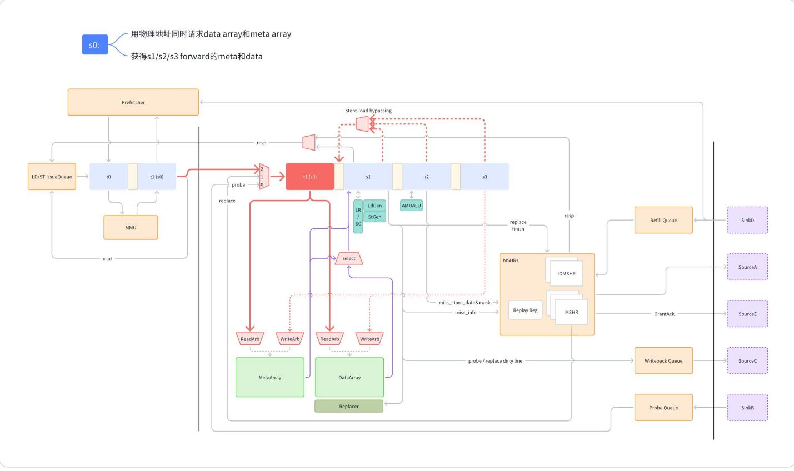

# DCache

- Init submodules

```
make init
```

- Generate DCache SystemVerilog

```
make dcache
```

- Test

```
make test
```

# 1. Feature List

Version1 Feature List:

- Highly configurable & loosely coupled
- Nonblocking
- 2 cycle load to use & cache hit lat 1 cycle
- PIPT (latency + 1cycle)
- Single Load/store pipe
- Access Bandwidth 8/16/32/64 bytes (matrix ld/st 不经过 L1)
- Replacement policy: PLRU
- Prefetcher: Stream + Stride
- [V/M] Support L1 bypassing

## Future Feature List

- ⽀持多 load/store pipe: 1 load pipe & 1 store pipe --> multiple load pipe & multiple store pipe
- Prefetcher: Plus SMS+BOP (BOP move to L2 later)
- Replacement Policy: RRIP
- ECC
- 可以转换 AXI/TileLink Bus
- 开机启动时⽀持 Uncacheable 模式

# 2. Architecture Overview

## 2.1 Processing Logic

Pipeline stages:

- t0: 虚拟地址翻译成物理地址
- t1/s0: 获得地址翻译结果,根据物理地址读取 data array 和 meta array
- s1: 获得 data array 和 meta array 结果,判断 hit/miss。hit 则组织数据,返回结果;miss 则 allocate mshr
- s2: 组织 AMOALU 要 store 的数据
- s3: 写 data array 和 meta array
- s4: data array 和 meta array 写⼊完成

### FSM in MSHRs

- MSHR -> Pipeline Load/Write Miss(Refill Queue -> Replay Reg -> Write Cache) + Hit But Need Write Permission
- IOMSHR -> Bypass(Refill Queue -> LSU) + MMIO(Uncacheable) + AMO(TileLink Atomic)

## 2.2 Modules

- Storage
  - Data array
  - Meta array (include tag & coherence meta)
- MSHR/IOMSHR: Handling Cache Miss (FSM)
- Refill Queue
- Writeback Queue
- Probe Queue
- Prefetcher
- Replacer


# 3. DCache Interfaces

## 3.1 Overview


## 3.2 DataExchangeIO

地址翻译之后发给 cache

| 信号               | ⽅向   | 源          | ⽬的        | 信号组名 | 位宽                      | 描述                                                               |
| ------------------ | ------ | ----------- | ----------- | -------- | ------------------------- | ------------------------------------------------------------------ |
| clock              | input  |             |             |          | 1                         | 时钟信号                                                           |
| reset              | input  |             |             |          | 1                         | 异步复位信号                                                       |
| io_req_valid       | input  | Core/Vector | Cache       | req      | 1                         |                                                                    |
| io_req_ready       | output | cache       | Core/Vector | req      | 1                         |                                                                    |
| io_req_bits_source | input  | Core/Vector | Cache       | req      | srcWidth                  | req 来源; scalar int(0)/scalar fp(1)/vector(2)/matrix(3)           |
| io_req_bits_dest   | input  | Core/Vector | Cache       | req      | destWidth                 | 对于 scalar 来说,是寄存器地址,对于 vector 来说,是 vlsu queue index |
| io_req_bits_cmd    | input  | Core/Vector | Cache       | req      | M_SZ                      | 访存操作类型,如 READ/WRITE/PARTIAL WRITE/AMO                       |
| io_req_bits_paddr  | input  | Core/Vector | Cache       | req      | paddrWidth                | 物理地址                                                           |
| io_req_bits_size   | input  | Core/Vector | Cache       | req      | log2Up(log2Up(dataBytes)) | 数据⼤⼩                                                           |
| io_req_bits_signed | input  | Core/Vector | Cache       | req      | 1                         | 是否做符号位扩展                                                   |
| io_req_bits_wdata  | input  | Core/Vector | Cache       | req      | max(VLEN, XLEN)           | 写操作的数据                                                       |
| io_req_bits_wmask  | input  | Core/Vector | Cache       | req      | max(VLEN/8, XLEN/8)       | 写操作的 mask                                                      |
|                    |        |             |             |          |                           |                                                                    |
| io_req_bits_nAlloc       | input      | Core/Vector | Cache       | req  | 1                                     | 不需要 cache 分配 entry                                                                                                       |
| io_req_bits_isRefill     | input      | Core/Vector | Cache       | req  | 1                                     | 是否是 refill 请求<br>(for test)                                                                                              |
| io_req_bits_refillCoh    | input      | Core/Vector | Cache       | req  | cohWidt<br>h                          | refill 指定的 coherence<br>state (for test)                                                                                   |
|                          |            |             |             |      |                                       |                                                                                                                               |
|                          |            |             |             |      |                                       |                                                                                                                               |
| io_resp_valid            | outpu<br>t | Cache       | Core/Vector | resp | 1                                     |                                                                                                                               |
| io_resp_bits_s<br>ource  | outpu<br>t | Cache       | Core/Vector | resp | srcWidth                              | req 来源                                                                                                                      |
| io_resp_dest             | outpu<br>t | Cache       | Core/Vector | resp | destWidt<br>h                         | 对于 scalar 来说,是寄存器地址,对于<br>vector 来说,是 vlsu<br>queue index                                                      |
| io_resp_bits_s<br>ize    | outpu<br>t | Cache       | Core        | resp | log2Up(l<br>og2Up(d<br>ataBytes)<br>) | 数据⼤⼩(FP 需要)                                                                                                             |
| io_resp_status           | outpu<br>t | Cache       | Core/Vector | resp | respStat<br>usWidth                   | resp 状态,包含 hit/miss/replay(重发当<br>handle 之后返回结果)<br>前指令)/refill(miss<br>hit(0), miss(1), replay(2), refill(3) |
| io_resp_bits_h<br>asData | Outp<br>ut | Cache       | Core/Vector | resp | 1                                     | 是否携带数据                                                                                                                  |
| io_resp_bits_d<br>ata    | outpu<br>t | Cache       | Core/Vector | resp | max(VLE<br>N, XLEN)                   | load 数据                                                                                                                     |
|                          |            |             |             |      |                                       |                                                                                                                               |
|                          |            | Cache       | Core        | resp | 1                                     |                                                                                                                               |
| io_nextCycleW<br>b | outpu<br>t |       |       |      |     | 下⼀个周期 cache 要写回 scalar 数据,占<br>⽤ wb 阶段,因此不能处理 s0 阶段的请求 |
| io_fenceRdy        | Outp<br>ut | Cache | Core  | resp | 1   | cache 中所有请求都已经结束<br>fence 等待完成,可以执⾏后续指令                   |
|                    |            |       |       |      |     |                                                                                 |
| io_s0_kill         | Input      | Core  | Cache |      | 1   | 流⽔线控制信号;kill 掉 s0 阶段的操作                                            |
| io_s1_kill         | Input      | Core  | Cache |      | 1   | 流⽔线控制信号;kill 掉 s1 阶段的操作                                            |

## 3.3 接⼝时序

### 3.3.1 Load hit

s0 阶段,接收 cache req 请求

s1 阶段,cache hit,返回结果


### 3.3.2 Load miss

s0 阶段，接收 cache req 请求

s1 阶段，cache miss, 返回 resp

之后 cache 进入 mshr 状态机，

数据回来之后，

如果是 scalar cache miss: 在将数据发送给 scalar pipe 之前一个周期，要先发送一个 nextCycleWb, 通知 pipeline 下一个周期 cache 要写回; 一个周期之后，返回 cache 结果

如果非 scalar, 则不需要提前一周期发 nextCycleWb


### 3.3.3. Store Hit

s0 阶段，接收 cache req 请求

s1 阶段，cache hit，返回响应


### 3.3.4. Store Miss

s0 阶段，接收 cache req 请求

s1 阶段，cache miss，返回响应

当作已经完成请求，不需要再做回复
s0 阶段,接收 cache req 请求


### 3.3.5 (Miss & MSHR full) | address conflict --> Replay

如果遇到了 mshr 满或者地址冲突的情况,

在 s1 阶段,返回 replay, 表⽰要重新执⾏这条指令,同时会把 cache ready 信号拉低,防⽌乱序访存


### 3.3.6 综合

- req1 和 req2 为对相同地址的 load 指令，都发生了 cache miss
- req3 发生了 cache hit
- req4 在 s1 阶段返回结果要 replay, 同时 req1/req2 要返回结果，因此发送了 nextCycleWb
- 发送完 nextCycleWb 之后，req1 和 req2 开始 refill
- 在 nextCycleWb 拉高的时间段，不能处理 s0 阶段的请求；在 nextCycleWb 拉低之后，处理下一个请求，因为 req4 需要 replay, 所以下一个请求重发 req4
- req4 发生 cache miss
  

## 3.4. DCache <-> L2 Tilelink









# 4. Memory Operations

|                         |                                                  |          |                                                                                                                                                                         |
| ----------------------- | ------------------------------------------------ | -------- | ----------------------------------------------------------------------------------------------------------------------------------------------------------------------- |
| **Operations**          | **Explain**                                      | Encoding | Constraints                                                                                                                                                             |
| Normal (support)        |                                                  |          |                                                                                                                                                                         |
| **M_XRD**               | Int load                                         | 00000    | - 支持符号位扩展<br> <br>- 支持 mmio<br> <br>- 支持 bypass                                                                                                              |
| **M_XWR**               | Int store                                        | 00001    | - 不支持符号位扩展<br> <br>- 支持 mmio<br> <br>- 支持 bypass                                                                                                            |
| **M_PWR**               | Partial masked store                             | 10001    | - 不支持符号位扩展<br> <br>- 不支持 mmio<br> <br>- 支持 bypass<br> <br>- size 必须为 6 (64Byte)                                                                         |
| Prefetch (Support)      |                                                  |          |                                                                                                                                                                         |
| **M_PFR**               | Prefetch with intent to read                     | 00010    | - 不支持符号位扩展<br> <br>- 不支持 mmio<br> <br>- 不支持 bypass<br> <br>- 不返回结果<br> <br>- 不保证指令完成(例如 s1 MSHR 满了，prefetch 请求不会 replay，而是被丢弃) |
| **M_PFW**               | Prefetch with intent to write                    | 00011    | - 不支持符号位扩展<br> <br>- 不支持 mmio<br> <br>- 不支持 bypass<br> <br>- 不返回结果<br> <br>- 不保证指令完成(例如 s1 MSHR 满了，prefetch 请求不会 replay，而是被丢弃) |
| CMO （Not Support)      |                                                  |          |                                                                                                                                                                         |
| **M_FLUSH**             | Write back dirty data and cede R/W permissions   | 10000    |                                                                                                                                                                         |
| **M_PRODUCE**           | Write back dirty data and cede W permission      | 10010    |                                                                                                                                                                         |
| **M_CLEAN**             | Write back dirty data and retain R/W permissions | 10011    |                                                                                                                                                                         |
| **M_FLUSH_ALL**         | Flush all lines                                  | 00101    |                                                                                                                                                                         |
| AMO (Support)           |                                                  |          |                                                                                                                                                                         |
| **M_XLR**               | Load reserved                                    | 00110    | - 总是做符号位扩展<br> <br>- 不支持 mmio<br> <br>- 不支持 bypass<br> <br>- Size 为 2 或者 3 (word/double word)                                                          |
| **M_XSC**               | Store conditional                                | 00111    | - 不支持符号位扩展<br> <br>- 不支持 mmio<br> <br>- 不支持 bypass<br> <br>- Size 为 2 或者 3 (word/double word)                                                          |
| **M_XA_SWAP**           |                                                  | 00100    | - 总是做符号位扩展<br> <br>- 支持 mmio<br> <br>- 支持 bypass<br> <br>- Size 为 2 或者 3 (word/double word)                                                              |
| **M_XA_ADD**            |                                                  | 01000    |                                                                                                                                                                         |
| **M_XA_XOR**            |                                                  | 01001    |                                                                                                                                                                         |
| **M_XA_OR**             |                                                  | 01010    |                                                                                                                                                                         |
| **M_XA_AND**            |                                                  | 01011    |                                                                                                                                                                         |
| **M_XA_MIN**            |                                                  | 01100    |                                                                                                                                                                         |
| **M_XA_MAX**            |                                                  | 01101    |                                                                                                                                                                         |
| **M_XA_MINU**           |                                                  | 01110    |                                                                                                                                                                         |
| **M_XA_MAXU**           |                                                  | 01111    |                                                                                                                                                                         |
| FENCE (To be discussed) |                                                  |          |                                                                                                                                                                         |
| **M_SFENCE**            |                                                  | 10100    |                                                                                                                                                                         |
| **M_HFENCEV**           |                                                  | 10101    |                                                                                                                                                                         |
| **M_HFENCEG**           |                                                  | 10110    |                                                                                                                                                                         |
|                         |                                                  |          |                                                                                                                                                                         |
| **M_WOK**               |                                                  | 10111    |                                                                                                                                                                         |
| **M_HLVX**              |                                                  | 10000    |                                                                                                                                                                         |

# 5. Storage

## 5.1 Configuration

| rowBits  | SRAM row bits (固定为 64) |
| -------- | ------------------------- |
| numBanks | bank 数量                 |
| numWays  | 组关联数量                |
| numSets  | set 数量                  |

## 5.2 Address

地址索引与数据选择


## 5.3 Data Array

1. SRAM ⼀般单⼝,单⼝ SRAM 的⾯积功耗更⼩,⽽且带来的性能损失⾮常⼩; 双⼝的主要是⾯积⽐较⼤,如果将来总容量很⼤的话,那么 floorplan 上⽐较难处理,时序也就难于上去了。
2. SRAM ⼀般做成⽅形的结构,⽐如 64\*64, ⻓形结构像 1024\*8 是不好的

### 5.3.1 功能

负责 DCache 数据 data 的存储与读写, 每个 bank 有⼀个读⼝和⼀个写⼝

假设 32Kb cache; SRAM row = 64 bits; 4 个 bank; 4 way 组关联 => ⼀共有 128 个 Sets 也就是说:

- numBanks b = 4
- numSets s = 128
- rowBits r = 64
- SRAM entries = numSets \* (cache line size / (numBanks \* rowBits)) = 128 \* (512 / (4 \* 64)) = 256

### 5.3.2 Interface

| **信号** | **方向** | **源**     | **目的**   | **信号组名** | **位宽**                   | **描述**      |
| -------- | -------- | ---------- | ---------- | ------------ | -------------------------- | ------------- |
| clock    | input    |            |            |              |                            |               |
| reset    | input    |            |            |              |                            |               |
| rvalid   | input    | Main pipe  | Data Array | read_req     | 1                          |               |
| rready   | output   | Data Array | Main pipe  | read_req     | 1                          |               |
| rsetIdx  | input    | Main pipe  | Data Array | read_req     | log2Up(nSets)              |               |
| rbankIdx | input    | Main pipe  | Data Array | read_req     | log2Up(nBanks)             |               |
| rwayEn   | input    | Main pipe  | Data Array | read_req     | nWays                      |               |
|          |          |            |            |              |                            |               |
| resp     | output   | Data Array | Main Pipe  | read_resp    | nWays _ (nBanks _ rowBits) |               |
|          |          |            |            |              |                            |               |
| wvalid   | input    | Main pipe  | Data Array | write_req    | 1                          |               |
| wready   | output   | Data Array | Main pipe  | write_req    | 1                          |               |
| wsetIdx  | input    | Main pipe  | Data Array | write_req    | log2Up(nSets)              |               |
| wbankIdx | input    | Main pipe  | Data Array | write_req    | log2Up(nBanks)             |               |
| wwayEn   | input    | Main pipe  | Data Array | write_req    | nWays                      | Pop count = 1 |
| wdata    | input    | Main pipe  | Data Array | write_req    | nBanks \* rowBits          |               |
| wmask    | input    | Main pipe  | Data Array | write_req    | nBanks \* rowWords         |               |
|          |          |            |            |              |                            |               |

### 5.3.3 Structure


假设 32Kb cache; SRAM row = 64 bits; 4 个 bank; 4 way 组关联 => ⼀共有 128 个 Sets


## 5.4 Meta Array

### 5.4.1 功能

负责 DCache tag 与 coherence meta 的存储与读写

### 5.4.2 Interface

| **信号** | **方向** | **源**     | **目的**   | **信号组名** | **位宽**          | **描述**      |
| -------- | -------- | ---------- | ---------- | ------------ | ----------------- | ------------- |
| clock    | input    |            |            |              |                   |               |
| reset    | input    |            |            |              |                   |               |
| rvalid   | input    | Main pipe  | Meta Array | read_req     | 1                 |               |
| rready   | output   | Meta Array | Main pipe  | read_req     | 1                 |               |
| rsetIdx  | input    | Main pipe  | Meta Array | read_req     | log2Up(nSets)     |               |
| rwayEn   | input    | Main pipe  | Meta Array | read_req     | nWays             |               |
|          |          |            |            |              |                   |               |
| resp     | output   | Meta Array | Main Pipe  | read_resp    | nWays \* metaBits |               |
|          |          |            |            |              |                   |               |
| wvalid   | input    | Main pipe  | Meta Array | write_req    | 1                 |               |
| wready   | output   | Meta Array | Main pipe  | write_req    | 1                 |               |
| wsetIdx  | input    | Main pipe  | Meta Array | write_req    | log2Up(nSets)     |               |
| wwayEn   | input    | Main pipe  | Meta Array | write_req    | nWays             | Pop count = 1 |
| wdata    | input    | Main pipe  | Meta Array | write_req    | metaBits          |               |
|          |          |            |            |              |                   |               |

### 5.4.3 Structure


# 6. 处理流程

## 6.1 Load

### 6.1.1 Cache hit

- s0:
  - ⽤物理地址同时请求 data array 和 meta array
  - 获得 s1/s2/s3 forward 的 meta 和 data



- s1:
  - 从 metaArray 读的 meta 结果和后续 forward 过来的 meta 结果中选出最新的 meta，判断 way $w$ hit
  - 从 data array 以及 store-to-load forwarding 的数据中选出最新的 way $w$的 data
  - 通过 loadGen 组织好数据(size & signed)，返回 resp
  - 更新 replacer (way $w$是最近被访问的)


## 6.1.2 Cache miss && replace

- s0:
  - 用物理地址同时请求 data array 和 meta array
  - 获得 s1/s2/s3 forward 的 meta 和 data
- s1:
  - 根据最新的 meta 结果，判定为 cache miss;
  - 分配 mshr entry, 开始将 req 写入 mshr entry
  - 返回 resp


- s2 进⼊ mshr 状态机: - Refill: 向 L2 请求数据,写⼊ Refill buffer - Refill 完成: - MSHR 发送 replace req 进⼊ main pipeline, 读出被替换的数据,如果是 dirty 的则写⼊ wb queue; s1 请求 replacer 获得 victim way; 然后将 refill 数据覆盖原来的 victim way; 更新 replacer (具体过程⻅ replace)
  

## 6.2 Store

## 6.2.1 Cache hit

- s0:
  - 用物理地址同时请求 data array 和 meta array
  - 获得 s1/s2/s3 forward 的 meta 和 data
- s1:
  - 从 metaArray 读的 meta 结果和后续 forward 过来的 meta 结果中选出最新的 meta，判断 way $w$ hit ;
  - 从 data array 以及 store-to-load forwarding 的数据中选出最新的 way $w$的 data
  - 返回 resp
  - 通过 storeGen 组织好要写入的数据(size & signed)，与之前读出来的 way $w$ 数据合并到一起
  - 更新 replacer (way $w$是最近被访问的)


- s2:传递 meta/data 更新数据
- s3:
  - 将数据写⼊ data array
  - 更新 meta 中的 coherence state


• s4: meta/data array 写⼊完成

## 6.2.2 Cache no permission miss && replace

- s0:
  - ⽤物理地址同时请求 data array 和 meta array
  - 获得 s1/s2/s3 forward 的 meta 和 data
- s1:
  - 根据最新的 meta 结果,判定为数据存在但没有权限的 cache miss;
  - 通过 storeGen 组织好要写⼊的数据(size & signed),与之前读出来的 way $w$数据合并到⼀起
  - 分配 mshr entry, 开始将 req 写⼊ mshr entry
- s2
  - pipeline 中进⾏ meta 传递, 并且将 store 数据传⼊ mshr
  - s2 进⼊ mshr 状态机:
  - Refill: 向 L2 请求数据,写⼊ Refill buffer
  - Refill 完成:
    - 请求 replacer 分配 victim way
    - 合并 store 的数据到 refill 数据
    - MSHR 发送 replace req 进⼊ main pipeline, 读出被替换的数据,如果是 dirty 的则写⼊ wb queue; 然后将 refill 数据覆盖原来的 victim way
- s3: 将对应的 meta 清空 (防⽌后续 load 请求发⽣ cache hit)

## 6.2.3 Cache no data miss && replace

- s0:
  - 用物理地址同时请求 data array 和 meta array
  - 获得 s1/s2/s3 forward 的 meta 和 data
- s1:
  - 获得 tag 结果，数据不存在；判定为没有数据的 cache miss
  - 分配 mshr entry, 开始将 req 写入 mshr entry
- s2 进入 mshr 状态机:
  - Refill: 向 L2 请求数据，写入 Refill buffer
  - Refill 完成: - 合并 store 的数据到 refill 数据
  - MSHR 发送 replace req 进入 main pipeline, 请求 replacer 分配 victim way, 读出被替换的数据，如果是 dirty 的则写入 wb queue; 然后将 refill 数据覆盖原来的 victim way
  
整体过程见 load cache miss

## 6.3 Atomic

如果保证 ordering

aq/rl 的⽀持

- ⾹⼭对于 lr/sc 的特殊⽀持

> RISC-V spec 定义了 constrained LR/SC loops (参⻅ Volume I: RISC-V Unprivileged ISA: 8.3 Eventual Success of Store-Conditional Instructions). 受到 Rocket 的启发, ⾹⼭提供了类似的机制来处理 constrained LR/SC loops.
>
> 在 lr 指令执⾏之后, 处理器会依次进⼊以下三种状态:
>
> 1. 阻塞对当前核当前 cacheline 的所有 probe 请求并阻塞后续 lr 的执⾏, 持续⼀段时间 (lrscCycles - LRSCBackOff cycles)
> 2. 持续阻塞后续 lr 的执⾏, 但允许对这⼀ cacheline 的 probe 请求执⾏, 持续⼀段时间 (LRSCBackOff cycles)
> 3. 恢复到正常状态
>
> 对于⾹⼭(南湖), 在 lrscCycles - LRSCBackOff 周期内, constrained LR/SC loop (最多 16 条指令) ⼀定能执⾏完. 在这段时间内, 对 LR 所设置的 reservation set 中地址的 probe 操作将会被阻塞. 当前 hart 能不被打扰的执⾏⼀个成功的 SC. 随后的 LRSCBackOff 周期内后续的 lr 不会执⾏, 来防⽌两个核同时执⾏ lr, 结果两者都不能接受 probe 请求, 两者都拿不到权限从⽽卡死的情况. 加⼊这个退避阶段后, 来⾃其他核的 probe 请求可以取得 cacheline 的权限.
>
> RISC-V 对 LR 和 SC 之间的指令是有限制的,⼀个是 LR 和 SC 之间最⼤只能包含 16 个指令, 另外这些指令只能使⽤基础整数指令集(指令集 "I",不包含内存访问指令,跳转指令, fence 和 system 指令)。如果违反了这些限制,LR/SC 指令的效果是不受约束的
>
> <https://tinylab.org/riscv-atomics/>

### 6.3.1 LR/SC

lr/sc 指令,锁定的地址是 8-byte 对⻬的

#### 定义了两个时间参数

- lrscCycles: 80 (worst case is 14 mispredicted branches + slop)
- lrscBackoff: 3 (disallow LRSC reacquisition briefly)

根据这两个参数，lr/sc 分成了三个阶段:

1. Lrsc stage1: 阻塞对当前核当前 cacheline 的所有 probe 请求并阻塞后续 lr 的执行, 持续一段时间 (lrscCycles - LRSCBackOff cycles)
2. Lrsc stage2: 持续阻塞后续 lr 的执行, 但允许对这一 cacheline 的 probe 请求执行, 持续一段时间 (LRSCBackOff cycles)
3. Lrsc stage3: 恢复到正常状态

#### 执行流程

1. lr 指令进入 pipeline
   - s0
     - 请求进入 cache
     - 读取 tag 和 data
   - s1
     - tag check and way muxing。找到 match 的 way
     - 判定 cache hit, 返回 cache resp
     - 在 s1 阶段，如果是 lr 指令，则将 lrsc_count 置为 lrscCycles, 记录请求的地址，进入 lrsc stage 1
2. 等待 sc 指令的到来：每个 cycle, lrsc_count-1
3. sc 指令进入 pipeline
   - s0 同上
   - s1
     - 判定 cache hit
       - 如果是 sc 指令，判定
     - 请求进入 cache
     - 读取 tag 和 data

- s1
  - tag check and way muxing。找到 match 的 way
  - 判定 cache hit, 返回 cache resp
  - 在 s1 阶段，如果是 lr 指令，则将 lrsc_count 置为 lrscCycles , 记录请求的地址， 进入 lrsc stage 1

1. 等待 sc 指令的到来：每个 cycle, lrsc_count-1;
2. sc 指令进入 pipeline
   - s0 同上
   - s1
     - 判定 cache hit
       - 如果是 sc 指令，判定
         - lrsc_count- LRSCBackOff > 0
         - Address match
     - Reset lrsc_count


如果 lr 发生了 cache miss, 则分配 mshr, refill 数据/replace 完成之后，lr 指令重发进行 redo
sc success 和 fail resp 的 hasData 都为 true, success data = 0, fail data = 1
resp status cpu 侧不关心，现在 sc hit 还是返回 hit（hit 不代表 success), sc miss 返回 miss

## 6.3.2 AMO

### 6.3.2.1 Cache hit

- s0:
  - ⽤物理地址同时请求 data array 和 meta array
  - 获得 s1/s2 forward 的 meta 和 data
- s1:
  - 获得 tag 结果,判断 way w hit
  - 获得 n 路 data array 结果,选出 way w 的 data
  - 通过 LoadGen 组织好数据,返回 resp
  - 更新 replacer


- s2: 通过 AMOALU 计算写⼊ cache 的数据


- s3:
  - 将数据写⼊ data array
  - 更新 meta 中的 coherence state
- s4: meta/data array 写⼊完成

### 6.3.2.2 Cache miss

##### 6.3.2.2.1 Uncacheable address

- s0:
  - 用物理地址同时请求 data array 和 meta array
  - 获得 s1/s2/s3 forward 的 meta 和 data
- s1:
  - 获得 tag 结果，判定为 miss
  - 分配 IOMSHR, 开始将 req 写入 IOMSHR
- s2 进入 iomshr 状态机:
  - IOMSHR 通过 tilelink 发起 atomics 操作，获取数据并向下层 cache 写入
  - refill 完成，返回结果，不再写入 cache

> - 由于 L2 没有处理 AMO 请求的能力，需要在 L1 的 MSHR 中处理 Data/Permission Miss 的 AMO 请求，涉及的一些关键点如下：
>   - 为了保证 Permission Miss 的 AMO 请求可以被正确处理，在 MSHR 中添加了存储 AMO 数据的 Array（64b \* 8），当出现 Data/Permission Miss 时将 Core 发来的原始数据存入其中，且 Permission Miss 时会将 CacheLine 中的原数据也给入 MSHR
>   - 在 MSHR 中，AMO 请求不可以和任何同地址的 Store 请求合并，如果出现则需要持续 Replay 流水线直至 Refill 完成
>     - 同地址有前序的一条/多条 Store Req 时，AMO 需要 Replay
>     - MSHR Entry 有 AMO 指令，后续的 Store/AMO 需要 Replay

##### 6.3.2.2.2 Cacheable && Cache no permission miss && replace

- s0:
  - 用物理地址同时请求 data array 和 meta array
  - 获得 s1/s2/s3 forward 的 meta 和 data
- s1:
  - 根据最新的 meta 结果，判定为数据存在但没有权限的 cache miss
  - 分配 mshr entry, 开始将 req 写入 mshr entry
- s2:
  - pipeline 中进行 meta 传递, 并且将原数据（512b）和新数据（64b）传入 mshr
  - s2 进入 mshr 状态机:
    - Refill: 向 L2 请求数据
    - L2 返回权限之后
      - MSHR 中的 amoalu 计算写回 cache 的数据
      - MSHR 发送 replace req 进入 main pipeline 进行 replace
- s3: 将对应的 meta 清空（防止后续 load 请求发生 cache hit)

##### 6.3.2.2.3 Cacheable && Cache no data miss && replace

- s0:
  - ⽤物理地址同时请求 data array 和 meta array
  - 获得 s1/s2/s3 forward 的 meta 和 data
- s1:
  - 获得 tag 结果,数据不存在;判定为没有数据的 cache miss
  - 分配 mshr entry, 开始将 req 写⼊ mshr entry
- s2 进⼊ mshr 状态机:
  - pipeline 中进⾏ meta 传递, 并且将新数据(64b)传⼊ mshr
  - Refill: 向 L2 请求数据,写⼊ Refill buffer
  - Refill 完成:
    - Refill: 向 L2 请求数据
    - L2 返回数据之后
      - MSHR 中的 amoalu 计算写回 cache 的数据
      - MSHR 发送 replace req 进⼊ main pipeline 进⾏ replace

## 6.4 Probe

## 6.4.1 Invalid

- s0:
  - 用物理地址同时请求 data array 和 meta array
  - 获得 s1/s2/s3 forward 的 meta 和 data
- s1:
  - 获得 tag 结果，判定 probe 地址不存在
  - 将 probe 请求相关的信息发送给 writebackUnit
- s2:
  - WritebakUnit 通过 tilelink 向 L2 发送 probe ack

## 6.4.2 Valid & Clean

- s0:
  - 用物理地址同时请求 data array 和 meta array
  - 获得 s1/s2/s3 forward 的 meta 和 data
- s1:
  - 获得 tag 结果，判定 probe 地址存在，并且 clean
  - probe 请求相关的信息发送给 writebackUnit（后续 writeback unit 通过 tilelink 向 L2 发送 ProbeAck）
- s2: pipeline 传递信息
- s3:
  - 清除对应的 meta array / data array 数据

### 6.4.3 Valid & Dirty

- s0:
  - 用物理地址同时请求 data array 和 meta array
  - 获得 s1/s2/s3 forward 的 meta 和 data
- s1:
  - 获得 tag 结果，判定 probe 地址存在，并且 clean
  - probe 请求相关的信息发送给 writebackUnit（后续 writeback unit 通过 tilelink 向 L2 发送 ProbeAckData）


- s2: pipeline 传递信息
- s3:
  - 清除对应的 meta array / data array 数据

## 6.5 Replace

- s0:
  - 用 set index 同时请求 data array 和 meta array
- s1:
  - 请求 replacer 获得 victim way
  - 获得 victim way 的 meta 结果, 选出 data
  - 如果要 replace, 并且 replace way 处于 dirty 状态，则将其数据写入 wb queue
  - 更新 replacer
  - 通知 MSHR 当前 replace 过程已经完成


- s2: 传递 meta/data 更新的数据
- s3: meta/data array 写⼊
- s4: meta/data array 写⼊完成

## 6.6 Prefetch

对于 Prefetch 请求，不保证能够进行处理，有如下注意点:

1. Prefetch 指令不会返回 resp
2. Prefetch 指令，cache hit 的条件是 tag match, 不检查 permission
3. Cache miss 则 allocate mshr, allocate 不成功则直接丢弃，不需要 replay

## 6.7 Priority

1. Probe Req
2. Replace Req
3. Core Req

# 7. Replacement Policy

- Choice 1: Cache Refill 的时候 allocate victim way [we choose]
  - Pros: don't need to lock
  - Cons: need to read cacheline (to writeback) again when refill
- Choice 2: Cache Miss 的时候 allocate
  - Pros: only need to read cacheline once
  - Cons: need lock cache line

## 7.1 功能

Cache miss 的时候选择数据进⾏替换

MSHR 在 Refill 完成后,请求 replacer 获得 victim way

## 7.2 算法

⻅ Rocket

https://github.com/chipsalliance/rocket-chip/blob/dbcb06afe1c76d1129cb6d264949322a34c37185/src/main/scala/util/Replacement.scala#L11

### 可选

- SetAssocLRU
- SetAssocPLRU

## 7.3 Replace 过程

⻅ 5.6 [Replace](#6.5-replace)

# 8. MSHR

总体设计:


Feature:

- MSHR 可以 merge 多条访存指令， 此过程中：

  - TL-A 发出 Acquire 之前的指令可以合并，合并过程中保留指令顺序用于 replay，合并后会对发出的权限进行直接修改，取最高权限；注意点：连续的 Store 请求可以直接合并为一个请求，但是在出现 [Store -> Load -> Store] 时第二个 Store 不可以被合并入 MSHR（因为每个 MSHR Entry 只能存储一个 512 的 Store Data），此时会要求 Cache Pipeline 进行 Replay
  - TL-A 发出 Acquire 之后但是开始 Replay 之前的指令如果想要合并入 MSHR，需要查看
    - 1. 没有出现 [Store -> Load -> Store] 的请求组合
    - 2. 如果 Acquire 之前只有 Load 指令（则发出了对 B 权限的请求），则后续的 Store 请求因为权限不够不能合并入 MSHR，需要进行 Replay 直到拥有 B 权限的 Cacheline Refill

- 开始 Refill ReplayReg / Replay / Refill Cache 过程中出现的同地址 miss 需要被 replay 直到写回 cache
- IOMSHR 发出的请求不涉及 Cache Coherence 的问题，每个 Entry 只处理单个指令，不存在 merge 的功能
- MSHR 和 IOMSHR 包含在 MSHR Wrapper 这个顶层模块中，二者会对每个进入顶层模块的请求的地址进行匹配查询，此时可能会出现以下几种情况：

|               |                 |            |                                      |
| ------------- | --------------- | ---------- | ------------------------------------ |
| Req Inst Dest | Addr Hit Region | Final Dest | Behaviour                            |
| MSHR          | IOMSHR          | MSHR       | Replay                               |
| IOMSHR AMO    | MSHR            | IOMSHR     | Replay                               |
| IOMSHR MMIO   | MSHR            | IOMSHR     | Error (MMIO Addr Can't Acquire MSHR) |
| IOMSHR Bypass | MSHR            | MSHR       | Merge to MSHR                        |

- First Col: the destination of the current req (secondary req)
- Second Col: which module holds the current req addr (where primary req saved in)
- Third Col: where the req will be finally putted into

## 8.1 MSHR

Feature:

- MSHR Table / Replay Table / IOMSHR Table Coupling
- Replay On [Refill Buffer → Replay Reg]
- Priority: Probe > Replay > Allocate
- Don't allow send Read(Get S) and receive Write miss Req: Block and Replay on Cache Pipeline
- Only allow Read -> Write -> Read, subsequent Write requests can be received

### 8.1.1 架构


**About Replace：**

MSHR 在 refill 完成之后:

- 请求 replacer 选择 victim way
- 构建 replace_req 进入 main pipeline (replace_req 进入 main pipe 之后，不允许对该 victim way 的访问请求进入 pipeline)
  - s0 读取 victim way 信息，接收 store-to-load forwarding 数据
  - s1 读取完成，将 dirty 数据写入 wb buffer
  - s2 读取 replay reg, 开始覆盖 victim way
  - s3 覆盖完成

### 8.1.2 状态机


- `mode_idle`：空闲的 MSHR Entry
- `mode_req_enqueue`：将本条 MSHR 的 ID 放入到 mshr_req_queue 中，到 Queue 发送到本 ID 的请求时向 MSHR 发送唤醒请求，向 L2 发送的数据从 MSHR 内部直接发送；（为了解决：原 Miss 为 load，在等待发射时后续有 Miss 的 Write 指令进入，需要提高本次请求的权限，此情况下直接将 Current Permission 设置为 M）
- `mode_resp_wait`：等待总线的数据回传到 Refill Queue 中，等待数据返回后进入`mode_replay`状态，将 Refill Queue 中的数据读入 Replay Reg 对其进行 Replay
- `mode_replay`：当本 MSHR 条目为 Refill Queue 中第一条可用的数据，将其放入 Replay Reg，并使用 MSHR 中存储的 Replay Inst 对 Replay Reg 中存储的 Cache Line 进行 Replay；转换到本状态后向 WriteBack Queue 发送写回 Enable 以及 Tag
- `mode_refill`：write back 和 replay 都已经完成，从 replay reg 中对 cache line 进行 refill

**Notice：**

- 为了减少正常流水线上 Dcache 读写过程中需要查询的 DRAM/Regfile 数量，Refill Buffer, Replay Reg 中的 Tag 及数据都不可被查询

### 8.1.3 接⼝定义

|                         |                |                |                           |                                                                       |                                                       |
| ----------------------- | -------------- | -------------- | ------------------------- | --------------------------------------------------------------------- | ----------------------------------------------------- |
| **信号**                | **源**         | **目的**       | **Sub Bundle**            | **位宽**                                                              | **描述**                                              |
| clock                   |                |                |                           | 1                                                                     | 时钟信号                                              |
| reset                   |                |                |                           | 1                                                                     | 异步复位信号（0 使能）                                |
| **Cache Pipeline**      |                |                |                           |                                                                       |                                                       |
| io_pipelineReq_valid    | Cache pipeline | MSHR           |                           | 1                                                                     | S1 出现 Miss 时请求 MSHR 分配 Entry                   |
| io_pipelineReq_tag      |                |                |                           | PTAG_WIDTH                                                            | 出现 miss 的物理地址 tag                              |
| io_pipelineReq_rw_type  |                |                | meta                      | 1                                                                     | write(1)/read(0)                                      |
| io_pipelineReq_regIDX   |                |                | destWidth                 | 对于 scalar 来说，是寄存器地址，对于 vector 来说，是 vlsu queue index |                                                       |
| io_pipelineReq_typ      |                |                | log2Up(log2Up(dataBytes)) | 操作的数据的大小                                                      |                                                       |
| io_pipelineReq_signed   |                |                | 1                         |                                                                       |                                                       |
| io_pipelineReq_addrIdx  |                |                | PIDX_WIDTH                | 物理地址的 index                                                      |                                                       |
| io_pipelineReq_mask     |                |                |                           | VLEN/8                                                                | 以 byte 为最小宽度的 mask                             |
| io_pipelineReq_data     |                |                |                           | VLEN                                                                  | 数据总长度（512）                                     |
| io_pipelineReq_ready    | MSHR           | Cache pipeline |                           | 1                                                                     | MSHR 是否有空闲单元/是否存在冲突/是否有上位请求       |
|                         |                |                |                           |                                                                       |                                                       |
| io_toL2Req_valid        | MSHR           | TileLink       |                           | 1                                                                     |                                                       |
| io_toL2Req_priv         |                |                |                           | 1                                                                     | 请求的权限 write(1)/read(0)                           |
| io_toL2Req_tag          |                |                |                           | PTAG_WIDTH                                                            | 请求的物理地址                                        |
| io_toL2Req_ready        | TileLink       | MSHR           |                           | 1                                                                     | tilelink 允许发送请求                                 |
|                         |                |                |                           |                                                                       |                                                       |
| io_fromRefill_valid     | Refill Queue   | MSHR           |                           | 1                                                                     | Refill queue 中存在可用的数据                         |
| io_fromRefill_tag       |                |                |                           | PTAG_WIDTH                                                            |                                                       |
| io_fromRefill_data      |                |                |                           | VLEN                                                                  |                                                       |
| io_fromRefill_ready     | MSHR           | Refill Queue   |                           | 1                                                                     |                                                       |
|                         |                |                |                           |                                                                       |                                                       |
| io_fromProbe_valid      | Probe Unit     | MSHR           |                           | 1                                                                     |                                                       |
| io_fromProbe_tag        |                |                |                           | PTAG_WIDTH                                                            |                                                       |
| io_fromProbe_probeReady | MSHR           | Probe Unit     |                           | 1                                                                     | MSHR 中存在与 Probe 请求相同 tag 的 entry             |
|                         |                |                |                           |                                                                       |                                                       |
| io_toPipeline_valid     | MSHR           | Cache pipeline |                           | 1                                                                     | MSHR Replay Read 命令后向 cache pipeline 发起写回请求 |
| io_toPipeline_regIdx    |                |                |                           | destWidth                                                             |                                                       |
| io_toPipeline_regData   |                |                |                           | VLEN                                                                  |                                                       |
| io_toPipeline_ready     | Cache pipeline | MSHR           |                           | 1                                                                     |                                                       |
|                         |                |                |                           |                                                                       |                                                       |
| io_toReplace_valid      | MSHR           | Pipe s0        |                           | 1                                                                     | 向 S0 发出的 replace 请求信号                         |
| io_toReplace_priv       |                |                |                           |                                                                       | 读回的 miss 的 cacheline 的权限                       |
| io_toReplace_tag        |                |                |                           | PTAG_WIDTH                                                            |                                                       |
| io_toReplace_data       |                |                |                           | VLEN                                                                  | 在 S2 阶段发出的 replay reg 中的数据                  |
| io_toReplace_ready      | Pipe s0        | MSHR           |                           | 1                                                                     | S0 接收 replace 请求完成                              |
| io_replaceFinish        | Pipe s2        | MSHR           |                           | 1                                                                     | S2 在当前周期完成接收 replay reg 中的数据             |

## 8.2 IOMSHR

For Processing MMIO / Read Bypass MSHR / AMO

### 8.2.1 架构描述

#### 8.2.1.1 AMO

通过 TileLink 的 Atomic 指令直接实现

#### 8.2.1.2 MMIO

通过 IOMSHR 向总线发起请求,并将 Read 的请求进⾏ Replay

#### 8.2.1.3 Bypass

设计中的 Bypass 指 LSU 需要但 Miss 的数据不会先写入 DCache 再写入 LSU：

LSU Read：

- Hit：直接从 DCache 中读出并写入 LSU
- Miss：由 IOMSHR 记录缺失信息，当需要的数据返回时直接从 Refill Queue 写入 LSU（IOMSHR 不需要对 Cache 有写请求）

LSU Write：

- 直接从 LSU 写入 DCache，不存在 Bypass

(数据存在的话，cache hit 或者 cache miss 通过原来 mshr 通道去发送；数据不存在，通过 IOMSHR 的 get/put 发送请求)

#### 8.2.1.4 TileLink Usage


- AMO 范围内的访问直接使⽤ LogicalData / ArithmeticData 两种请求
- MMIO 范围内的访问直接使⽤ put / get
- Bypass 范围内的请求,load 直接使⽤ get,store 请求需要查看对应的请求命令是否为 M_PWR,如果是 partial store 则使⽤ PutPartialData,否则使⽤ put

### 8.2.2 状态机


- `mode_idle`: 初始状态
- `mode_amo_req`: 使⽤ TileLink 的原⼦接⼝发送,收到 grant 后转回初始状态
- `mode_wb`: 需要 Bypass Cache 的数据如果 hit 且 Dirty,则需要 Write Back
- `mode_inv_line`: invalidate hit 的 Cache Line
- `mode_req_enqueue`: 将需要向下发送的数据/地址 Enqueue
- `mode_resp_wait`: 等待返回相应
- `mode_replay`: 如果 MMIO 请求为 Read,则对其进⾏ Replay
- `moe_fill_LSU`: 如果为 Bypass 请求,则从 Refill Queue 中直接写⼊ LSU

# 9. WritebackQueue

WritebackQueue 接收 Cache 替换块以及组织对 probe 请求的响应,返回给 L2

- 对于 probe 请求,给 L2 发送 probeAck[C]
- 对于 release,给 L2 发送 Release[C], 并且等待 L2 返回 ReleaseAck[D]

### 限制:

1. MSHR 在发送 pending Grant 时,不能发送相同地址的 Release; 也就是说 miss 的地址不能出现在 WBU 中 (=> miss check)
2. 对于相同地址的 writeback 请求,需要保序或者合并 (=>FIFO Queue)

## 9.1 Interface


|                        |          |          |          |               |                                              |                                                         |
| ---------------------- | -------- | -------- | -------- | ------------- | -------------------------------------------- | ------------------------------------------------------- |
| **信号**               | **方向** | **源**   | **目的** | **信号组名**  | **位宽**                                     | **描述**                                                |
| clock                  | input    |          |          |               | 1                                            | 时钟信号                                                |
| reset                  | input    |          |          |               | 1                                            | 异步复位信号                                            |
|                        |          |          |          |               |                                              |                                                         |
| io_req_ready           | output   | WBU      | Pipeline | WritebackReq  | 1                                            |                                                         |
| io_req_valid           | input    | Pipeline | WBU      | 1             |                                              |                                                         |
| io_req_lineAddr        | input    | Pipeline | WBU      | lineAddrWidth | 写回的 line addr                             |                                                         |
| io_req_perm            | input    | Pipeline | WBU      | TODO          | permission                                   |                                                         |
| io_req_hasData         | input    | Pipeline | WBU      | 1             | 是否携带数据                                 |                                                         |
| io_req_data            | input    | Pipeline | WBU      | dataWidth     | 要写回的数据                                 |                                                         |
| io_req_voluntary       | input    | Pipeline | WBU      | 1             | release 是 voluntary; probe 则不是 voluntary |                                                         |
|                        |          |          |          |               |                                              |                                                         |
| io_missCheck_valid     | Input    | Pipeline | WBU      | Miss          | 1                                            | 查找 miss 的 addr 是否在 WBU 中存在，如果存在返回 block |
| io_missCheck_lineAddr  | Input    | Pipeline | WBU      | lineAddrWidth |                                              |                                                         |
| io_missCheck_blockMiss | Output   | WBU      | Pipeline | 1             |                                              |                                                         |
|                        |          |          |          |               |                                              |                                                         |
| io_release_X           |          |          |          |               |                                              | Tilelink C 通道；发送 release/ProbeAck[Data]            |
|                        |          |          |          |               |                                              |                                                         |
| io_grant_X             |          |          |          |               |                                              | Tilelink D 通道；接收 ReleaseAck                        |

## 9.2 WBQueue Structure

- enqPtr: wb req 进⼊时加 1
- deqPtr: wbFinish 时加 1(ProbeAck 发送出去/Release 收到 ReleaseAck)


## 9.3 WB Entry FSM

### 9.3.1 States

- s_invalid: 复位状态,该 Entry 为空项
- s_release_req: 正在发送 Release 或者 ProbeAck 请求
- s_release_resp: 等待 ReleaseAck 请求

### 9.3.2 State transition


- s_invalid
  - 条件：接收到 wbReq
  - 动作：存储 req 到寄存器
  - 下一个状态：s_release_req
- s_release_req
  - 动作：组织当前 beat 的数据和 tilelink message, 发送
  - 下一个状态
    - 所有 beats 发送完成且为 probe：s_invalid
    - 所有 beats 发送完成且为 release：s_release_resp
    - beats 未发送完成: s_release_req
- s_release_resp
  - 下一个状态：
    - 接收到 releaseAck：s_invalid
    - 未接收到 releaseAck：s_release_resp

## 9.4 Corner Case

### 9.4.1 Address Conflict

WBU 的地址有两个来源:

- Probe
- Replace

限制: MSHR 在发送 pending Grant 时,不能发送相同地址的 Release 也就是说 miss 的地址不能出现在 WBU 中

### 9.4.2 WBQ Full

当 Writeback queue full 的时候,不能再接收来⾃ probe queue 以及 mshr replace 的数据:

- probequeue 收到 s1 阶段 wb 不 ready 的信号,会重发当前的 probe 请求
- mshr 同理

# 10. ProbeQueue

probeQueue 接收下层或者别的 core 的 cache 发送来的 coherence requests,向 cache main pipeline 发送请求

## 10.1 Interface

|                        |          |           |           |              |               |                                                                              |
| ---------------------- | -------- | --------- | --------- | ------------ | ------------- | ---------------------------------------------------------------------------- |
| **信号**               | **方向** | **源**    | **目的**  | **信号组名** | **位宽**      | **描述**                                                                     |
| clock                  | input    |           |           |              | 1             | 时钟信号                                                                     |
| reset                  | input    |           |           |              | 1             | 异步复位信号                                                                 |
|                        |          |           |           |              |               |                                                                              |
| io_memProbe_X          | Input    |           | ProbeUnit |              |               | 与 L2 交互的 B 通道                                                          |
|                        |          |           |           |              |               |                                                                              |
| io_mainPipeReq_X       | Output   |           | Main Pipe |              |               | 将 probe 请求发送给 main pipeline                                            |
|                        |          |           |           |              |               |                                                                              |
| io_probeResp           | Input    | Main Pipe | ProbeUnit |              |               | pipeline 返回给的 probe 请求的处理情况，有 invalid/finish/replay 集中情况    |
|                        |          |           |           |              |               |                                                                              |
| io_lrscAddr_valid      | Input    |           |           |              | 1             | constrained LR/SC loop 执行期间，对 LR 所设置的地址块的 probe 操作需要被阻塞 |
| io_lrscAddr_bits       | Input    |           |           |              |               |                                                                              |
|                        |          |           |           |              |               |                                                                              |
| io_probeCheck_valid    | Ouput    |           |           |              | 1             |                                                                              |
| io_probeCheck_lineAddr | Output   |           |           |              | lineAddrWidth |                                                                              |
| io_probeCheck_block    | Input    |           |           |              | 1             |                                                                              |
|                        |          |           |           |              |               |                                                                              |
| io_wbReq_X             |          |           |           |              |               |                                                                              |

## 10.2 FSM

### 10.2.1 states

- s_invalid: 复位状态,该 Entry 为空项
- s_check_mshr: 检查 mshr 是否有相同地址请求
- s_wait_mshr: 等待 Mshr 完成
- s_pipe_req: 可以向 pipeline 发出 probe 请求。发出条件为 MSHR 以及 Pipeline 中没有对该地址的请求,lrsc 也不处于 lrsc stage1
- s_wb_req: probe 请求进⼊ writebackQueue
- s_wait_resp: 等待 pipeline 响应

### 10.2.2 State transition


## 10.3 MSHR 与 Probe

Probe 指令在进⼊ DCache 后,会先请求 MSHR,查看其中是否存在相同的地址,然后进⾏后续的操作,MSHR 中相同地址的请求及其状态会影响 Probe 的后续执⾏。访问 MSHR 后放回的信号有以下两个:

| 信号 | ⽅向   | 源  | ⽬的 | 信号组名 | 位宽 | 描述                                                                       |
| ---- | ------ | --- | ---- | -------- | ---- | -------------------------------------------------------------------------- |
| hit  | output |     |      |          | 1    | MSHR 中存在与 Probe 地址相同的 Entry                                       |
| pass | output |     |      |          | 1    | MSHR/Reill Queue 中对应 Entry 的状态允许放⾏ Probe 指令进⼊ Cache Pipeline |

### MSHR 中的状态命名:

| Probe MSHR State | Encode | Description                                                                      |
| ---------------- | ------ | -------------------------------------------------------------------------------- |
| miss             | 00     | Not hit in MSHR                                                                  |
| hitGo            | 01     | Hit in MSHR, but can complete immediately (No need to acquire meta & data Array) |
| hitBlockN        | 10     | Hit in MSHR, may need to be blocked, depend on refill queue                      |
| hitBlockB        | 10     | Hit in MSHR, need to be blocked                                                  |

根据 MSHR 和 Reill Queue 中的数据判断是否可以放⾏ Probe 请求(以下判断条件⾄少满⾜ hit=1):

|      | Data In RefillQ        | Data Not In RefillQ |
| ---- | ---------------------- | ------------------- |
| BtoT | !pass && State -> NtoT | pass                |
| NtoB | !pass                  | pass                |
| NtoT | !pass                  | pass                |

**MSHR：**

Feature: 当出现冲突时直接阻塞 Probe 直到数据写回 meta & data Array，然后允许 Probe 进入流水线执行；后续可以改成将 Probe 信息融合到 MSHR Entry 中，让 Probe 可以乱序执行

- BtoT:
  - toN Probe & （两个核同时请求 T 权限）后拿到权限: MSHR 中存在 Entry 但是 Refill Queue 中没有 -> NtoT（Probe 先于 Replay 执行），Probe 直接执行完成（ProbeAck）
  - toN Probe & （两个核同时请求 T 权限）先拿到权限: MSHR 中存在 Entry 且 Refill Queue 中存在，Refill Queue 数据被前面阻塞，阻塞 toN（Replay 先于 Probe 执行），replay & refill 执行完成后允许 Probe 进入流水线执行（ProbeAckData）
  - toB Probe: 阻塞直到 replay & refill 完成，允许 Probe 进入流水线执行（ProbeAckData）
- NtoB:
  - toN Probe & （另外一个 Master 同时请求 T 权限）后拿到权限: Probe 直接完成（ProbeAck）
  - toN Probe & （另外一个 Master 同时请求 T 权限）先拿到权限: MSHR 中存在 Entry 且 Refill Queue 中存在，Refill Queue 数据被前面阻塞，阻塞 toN（Replay 先于 Probe 执行），replay & refill 执行完成后允许 Probe 进入流水线执行（ProbeAck）(可以直接将 Probe 标记为完成，不让数据写回 meta & data Array，后续再改）
  - toB Probe: Probe 直接完成（ProbeAck）
- NtoT:
  - toN Probe & （两个核同时请求 T 权限）后拿到权限: MSHR 中存在 Entry 但是 Refill Queue 中没有（Probe 先于 Replay 执行），Probe 直接执行完成（ProbeAck）
  - toN Probe & （两个核同时请求 T 权限）先拿到权限: MSHR 中存在 Entry 且 Refill Queue 中存在，Refill Queue 数据被前面阻塞，阻塞 toN（Replay 先于 Probe 执行），replay & refill 执行完成后允许 Probe 进入流水线执行（ProbeAckData）
  - toB Probe: 阻塞直到 replay & refill 完成，允许 Probe 进入流水线执行（ProbeAckData）

| MSHR 权限升级 | Probe 权限降级     | 两核竞争权限时先拿到还是后拿到                 | MSHR 和 RefillQueue 的情况                                                                           | 处理过程                                                                                    |
| ------------- | ------------------ | ---------------------------------------------- | ---------------------------------------------------------------------------------------------------- | ------------------------------------------------------------------------------------------- |
| B->T          | -> N               | 先                                             | MSHR 中存在 Entry<br>Refill Queue 中存在 Entry                                                       | [Replay -> Probe]<br>阻塞 Probe<br>MSHR replay & refill 执行完成后允许 Probe 进入流水线执行 |
|               | 后                 | MSHR 中存在 Entry<br>Refill Queue 中没有 Entry | [Probe -> Replay]<br>Probe 请求直接通过 Writeback Queue 发送 ProbeAck BtoN<br>MSHR 请求权限变为 N->T |
|               | -> B / -> T        | 先                                             | MSHR 中存在 Entry<br>Refill Queue 中存在 Entry                                                       | [Replay -> Probe]<br>阻塞 Probe<br>MSHR replay & refill 执行完成后允许 Probe 进入流水线执行 |
|               | 后                 | MSHR 中存在 Entry<br>Refill Queue 中没有 Entry | [Probe -> Replay]<br>Probe 请求直接通过 Writeback Queue 发送 ProbeAck BtoB                           |
| N->B          | -> N / -> B / -> T | 先                                             | MSHR 中存在 Entry<br>Refill Queue 中存在 Entry                                                       | [Replay -> Probe]<br>阻塞 Probe<br>MSHR replay & refill 执行完成后允许 Probe 进入流水线执行 |
|               |                    | 后                                             | MSHR 中存在 Entry<br>Refill Queue 中没有 Entry                                                       | [Probe -> Replay]<br>Probe 请求直接通过 Writeback Queue 发送 ProbeAck NtoN                  |
| N->T          | -> N / -> B / -> T | 先                                             | MSHR 中存在 Entry<br>Refill Queue 中存在 Entry                                                       | [Replay -> Probe]<br>阻塞 Probe<br>MSHR replay & refill 执行完成后允许 Probe 进入流水线执行 |
|               |                    | 后                                             | MSHR 中存在 Entry<br>Refill Queue 中没有 Entry                                                       | [Probe -> Replay]<br>Probe 请求直接通过 Writeback Queue 发送 ProbeAck NtoN                  |

## 10.4 LR/SC 与 Probe

LR/SC 指令执⾏过程分成 3 个阶段:

1. Lrsc stage1: 阻塞对当前核当前 cacheline 的所有 probe 请求并阻塞后续 lr 的执⾏, 持续⼀段时间 (lrscCycles - LRSCBackOff cycles)
2. Lrsc stage2: 持续阻塞后续 lr 的执⾏, 但允许对这⼀ cacheline 的 probe 请求执⾏, 持续⼀段时间 (LRSCBackOff cycles)

在 Lrsc stage1 的时候,需要阻塞 probe 请求

# 11. Refill Queue


Feature:

- Acquire Perm ⽐ Acquire Data 的请求占⽤ Refill Queue 接⼝的优先级更⾼,因此可能出现后接收到 TL-D Grant 的地址先 Refill MSHR 的情况

# 12. Hazard

## 12.1 Ldst A&B Same addr

### 12.1.1 Case 1: Load A -> Load B

- Load A hit -> Load B hit
- Load A miss
  - A 未 refill: B 成为 secondary miss, merge 到 A 的 mshr
  - A replayreg 拿到数据准备 replay/refill: B 需要在 s1 阶段返回 replay
  - A refill 写⼊ cache 完成: Load B hit

### 12.1.2 Case 2: Load A -> Store B

- Load A hit
  - A 权限>Branch, Store B hit
  - A 权限<=Branch, Store B miss, 处理过程⻅ 6.2.2
- Load A miss
  - A 向 L2 的 acquire 请求未发出: B 成为 secondary miss, merge 到 A 的 mshr, 发出更⾼权限的请求
  - A 向 L2 的 acquire 请求已发出: B 在 s1 阶段返回 replay
  - A refill 写⼊ cache: Store B miss

Version 1:

- A 向 L2 的 acquire 请求已发出: B merge 进 mshr, A refill 的数据回来后,同时做两件事
  - a. 发送 acquire B 对应权限的请求
  - b. 对于 A 及其之后,B 之前的 load 指令,返回结果

### 12.1.3 Case 3: Store A -> Load B

- Store A hit -> Load B hit
- Store A 数据/权限缺失 miss
  - A refill 未完成: B merge 进 mshr
  - A repaly/refill 过程中: B 在 s1 阶段返回 replay
  - A refill 写⼊ cache: Load B hit

补充: Store A -> Load B -> Store A

在 miss 的情况下第三条 storeA ⼀定在 s1 阶段返回 replay

### 12.1.4 Case 4: Store A -> Store B

- Store A hit -> Store B hit
- Store A miss
  - A refill 未完成: B merge 进 mshr
  - A repaly/refill 过程中: B 在 s1 阶段返回 replay
  - A refill 写⼊ cache: Store B hit

## 12.3 Replace

### 12.3.1 Case 1: Ldst A -> Replace A to B

store 将数据和 meta bypass 给 Replace 请求, 写⼊ wb buffer

### 12.3.2 Case 2: Replace A to B -> Ldst A

Ldst A 拿到 replace bypass 的信息, 判定 Ldst A miss

**Note:**
可以把 A replace 的数据 bypass 给 ldst A

### 12.3.3 Case 3: Ldst B -> Replace A to B

LdstB 在 s1 阶段返回 replay 重发

Version1:
MSHR 在 replace 过程中, 仍然允许在 replace 之前进⼊ pipeline 的对 B 的请求 merge 进来, 并且进⾏ replay

Load 从 replay reg 中读取数据

Store 将数据 merge 进 replay reg

⽽ replace 在 s2 才会读 replay reg, 可以保证所有 replace 之前的 store 指令的结果都已经 Merge 进来

### 12.3.4 Case 4: Replace A to B -> Ldst B

B Refill 的数据 bypass 给 ldst B

## 12.4 Prefetch

### 12.4.1 Case 1: PFR A -> Load B

同 [12.1.1](#1211-case-1-load-a---load-b)

- PFR A hit -> Load B hit
- PFR A miss
  - A 未 refill: B 成为 secondary miss, merge 到 A 的 mshr
  - A replayreg 拿到数据准备 replay/refill: B 需要在 s1 阶段返回 replay
  - A refill 写⼊ cache 完成: Load B hit

### 12.4.2 Case 2: PFR A -> Store B

同 [12.1.2](#1212-case-2-load-a---store-b)

- PFR A hit
  - A 权限>Branch, Store B hit
  - A 权限<=Branch, Store B miss, 处理过程⻅ 6.2.2
- PFR A miss
  - A 向 L2 的 acquire 请求未发出: B 成为 secondary miss, merge 到 A 的 mshr, 发出更⾼权限的请求
  - A 向 L2 的 acquire 请求已发出: B 在 s1 阶段返回 replay
  - A refill 写⼊ cache: Store B miss

### 12.4.3 Case 3: PFW A -> Load/Store B

同 [12.1.3](#1213-case-3-store-a---load-b)

- PFW A hit -> Load/Store B hit
- PFW A miss
  - A refill 未完成: B merge 进 mshr
  - A repaly/refill 过程中: B 在 s1 阶段返回 replay
  - A refill 写⼊ cache: Load/Store B hit

### 12.4.4 Case 4: Load A -> PFR B

- Load A hit -> PFR B hit 更新 replacer
- Load A miss
  - A refill 未完成: PFR B 被丢弃
  - A repaly/refill 过程中: PFR B 被丢弃
  - A refill 写⼊ cache: PFR B hit 更新 replacer

### 12.4.5 Case 5: Load A -> PFW B

- Load A hit
  - 如果 A 权限是 Branch, PFW B 虽然权限不够,但被视作 hit, 不更改 A 权限到 Tunk, 更新 replacer
  - 如果 A 权限>=Trunk, PFW B hit, 更新 replacer
- Load A miss
  - A refill 未完成: PFW B 被丢弃
  - A repaly/refill 过程中: PFW B 被丢弃
  - A refill 写⼊ cache: PFW B 虽然权限不够,但被视作 hit, 不更改 A 权限到 Tunk, 更新 replacer

### 12.4.6 Case 6: Store A -> PFR/PFW B

- Store A hit -> PFR/PFW B hit 更新 replacer
- Store A miss
  - A refill 未完成: PFR/PFW B 被丢弃
  - A repaly/refill 过程中: PFR/PFW B 被丢弃
  - A refill 写⼊ cache: PFR/PFW B hit 更新 replacer

### 12.4.7 Case 7: PFR/PFW A -> PFR/PFW B

- PFR/PFW A hit -> PFR/PFW B hit 更新 replacer
- PFR/PFW A miss
  - refill 未完成: PFR/PFW B 被丢弃
  - A repaly/refill 过程中: PFR/PFW B 被丢弃
  - A refill 写⼊ cache: PFR/PFW B hit 更新 replacer

### 12.4.8 Case 8: PFR A -> PFR B

- PFR/PFW A hit -> PFR/PFW B hit 更新 replacer
- PFR/PFW A miss
  - refill 未完成: PFR/PFW B 被丢弃
  - A repaly/refill 过程中: PFR/PFW B 被丢弃
  - A refill 写⼊ cache: PFR/PFW B hit 更新 replacer

## 12.5 MMIO

### 12.5.1 MMIO Load/Store/AMO A -> MMIO Load/Store/AMO B

MMIO Load/Store/AMO B replay 直到 MMIO Load/Store/AMO A 完成并且 deallocate

MMIO 操作不会和 MSHR 有关联

## 12.6 Cacheable Bypass

### 12.6.1 Bypass Load/Store A -> Load/Store B

- A 数据已经存在于 cache 或者 MSHR 中, 参照普通的 Load/Store A -> Load/Store B
- A 数据不存在于 cache 和 MSHR
  - Bypass Load/Store A miss, 进⼊ IOMSHR
  - Load/Store B 需要 replay 直到 Bypass Load/Store A 完成并且从 IOMSHR deallocate

### 12.6.2 Load/Store A -> Bypass Load/Store B

Bypass Load/Store B 和普通 Load/Store B ⾛⼀样的流程

## 12.7 AMO (⾮ MMIO)

### 12.7.1 Bypass Load/Store A (miss) -> AMO B

AMO B replay 直到 Bypass Load/Store A 完成并且 deallocate

然后进⼊ AMO 流程

### 12.7.2 Load A -> AMO B -> Load

- A 处于 invalid 状态
  - Load A allocate ⼀个新的 MSHR entry, AMO B 直接合并进⼊同⼀个 entry
- A 处于 Branch 状态
  - AMO B 权限不⾜, allocate ⼀个新的 MSHR entry 进⾏处理
- A 处于 Trunk 或者 Dirty 状态
  - AMO B 发⽣ cache hit, 返回结果, 写⼊ cache

### 12.7.3 Store A -> AMO B

- A 处于 invalid / Branch 状态
  - Store A allocate ⼀个新的 MSHR entry, AMO B replay 直到 Store A 在 MSHR 中完成并写回 cache
- A 处于 Trunk 或者 Dirty 状态
  - AMO B 发⽣ cache hit, 返回结果, 写⼊ cache

### 12.7.4 AMO A (miss) -> AMO/Bypass Load/(Bypass or not)Store B

AMO A 进⼊ MSHR

AMO/Load/Store B replay 直到 AMO A 完成并且 IOMSHR deallocate

然后进⼊ AMO/Load/Store 流程

## 12.8 LRSC

### 12.8.1 Load A -> LR B

- Load A hit
  - A 权限>Branch, LR B hit
  - A 权限<=Branch, LR B miss, 分配 mshr entry 进⾏处理, 同时 LR replay
- Load A miss
  - A 向 L2 的 acquire 请求未发出: LR B merge 到 A 的 mshr, 发出更⾼权限的请求, LR B replay
  - A 向 L2 的 acquire 请求已发出: LR B replay
  - A refill 写⼊ cache: LR B miss, 分配 mshr entry 进⾏处理, 同时 LR replay

### 12.8.2 Store A -> LR B

- Store A hit -> LR B hit
- Store A miss
  - A refill 未完成: LR B replay
  - A repaly/refill 过程中: LR B replay
  - A refill 写⼊ cache: LR B hit

### 12.8.3 LR A -> Load/Store B

只考虑 lr hit 的情况, 因为 lr miss 要 replay ⼀直到 hit

- s1 阶段 lrscCounter > 3
  - Load/Store 仍然按照流程返回 hit/miss, lrscCounter 置为 3, 进⼊退避阶段
- s1 阶段 lrscCounter < 3
  - Load/Store 仍然按照流程返回 hit/miss

### 12.8.4 LR A -> LR B

- s1 阶段 lrscCounter > 3
  - LR B replay, lrscCounter 置为 3, 进⼊退避阶段
- s1 阶段 lrscCounter < 3
  - LR B replay, lrscCounter 保持原有的递减

### 12.8.5 LR -> SC

- s1 阶段 lrscCounter > 3
  - Sc hit -> success
- s1 阶段 lrscCounter < 3
  - Sc fail

# 13. Cache Coherence

| CMD                                                                                                                                                                        | Initial Data State | Hit or miss | Transactions                                                                                      | Final Data State |
| -------------------------------------------------------------------------------------------------------------------------------------------------------------------------- | ------------------ | ----------- | ------------------------------------------------------------------------------------------------- | ---------------- |
| Read<br><br>`M_XRD`<br>`M_PFR`<br>`M_HLVX`                                                                                                                                 | Nothing            | miss        | Nothing -> [A] Send AcquireBlock<br>-> [D] Receive GrantData<br>-> [E] Send GrantAck<br>-> Branch | Branch           |
|                                                                                                                                                                            | Branch             | hit         |                                                                                                   | Branch           |
|                                                                                                                                                                            | Trunk              | hit         |                                                                                                   | Trunk            |
|                                                                                                                                                                            | Dirty              | hit         |                                                                                                   | Dirty            |
| Write<br><br>`M_XWR`<br>`M_PWR`<br>`M_XSC`<br>`M_XA_SWAP`<br>`M_XA_ADD`<br>`M_XA_XOR`<br>`M_XA_OR`<br>`M_XA_AND`<br>`M_XA_MIN`<br>`M_XA_MAX`<br>`M_XA_MINU`<br>`M_XA_MAXU` | Nothing            | miss        | Nothing -> [A] Send AcquireBlock<br>-> [D] Receive GrantData<br>-> [E] Send GrantAck<br>-> Dirty  | Dirty            |
|                                                                                                                                                                            | Branch             | miss        | Branch -> [A] Send AcquireBlock<br>-> [D] Receive Grant<br>-> [E] Send GrantAck<br>-> Dirty       | Dirty            |
|                                                                                                                                                                            | Trunk              | hit         | Trunk<br>-> Inside Cache Upgrade Perm<br>-> Dirty                                                 | Dirty            |
|                                                                                                                                                                            | Dirty              | hit         |                                                                                                   | Dirty            |
| Write intention<br><br>`M_XLR`<br>`M_PFW`                                                                                                                                  | Nothing            | miss        | Nothing -> [A] Send AcquireBlock<br>-> [D] Receive GrantData<br>-> [E] Send GrantAck<br>-> Trunk  | Trunk            |
|                                                                                                                                                                            | Branch             | miss        | Branch -> [A] Send AcquireBlock<br>-> [D] Receive Grant<br>-> [E] Send GrantAck<br>-> Trunk       | Trunk            |
|                                                                                                                                                                            | Trunk              | hit         |                                                                                                   | Trunk            |
|                                                                                                                                                                            | Dirty              | hit         |                                                                                                   | Dirty            |
| Flush (Include Replace)<br><br>`M_FLUSH_ALL`<br>`M_FLUSH`                                                                                                                  | Nothing            |             |                                                                                                   | Nothing          |
|                                                                                                                                                                            | Branch             |             | Branch<br>-> [C] Send Release<br>-> [D] Receive ReleaseAck<br>-> Nothing                          | Nothing          |
|                                                                                                                                                                            | Trunk              |             | Trunk<br>-> [C] Send Release<br>-> [D] Receive ReleaseAck<br>-> Nothing                           | Nothing          |
|                                                                                                                                                                            | Dirty              |             | Dirty<br>-> [C] ReleaseData<br>-> [D] Receive ReleaseAck<br>-> Nothing                            | Nothing          |
| Produce = toB<br><br>`M_PRODUCE`                                                                                                                                           | Nothing            |             |                                                                                                   | Nothing          |
|                                                                                                                                                                            | Branch             |             |                                                                                                   | Branch           |
|                                                                                                                                                                            | Trunk              |             | Trunk<br>-> [C] Release<br>-> [D] ReleaseAck<br>-> Branch                                         | Branch           |
|                                                                                                                                                                            | Dirty              |             | Dirty<br>-> [C] ReleaseData<br>-> [D] ReleaseAck<br>-> Branch                                     | Branch           |
| Clean<br><br>`M_CLEAN`                                                                                                                                                     | Nothing            |             |                                                                                                   | Nothing          |
|                                                                                                                                                                            | Branch             |             |                                                                                                   | Branch           |
|                                                                                                                                                                            | Trunk              |             |                                                                                                   | Trunk            |
|                                                                                                                                                                            | Dirty              |             | Dirty<br>-> [C] ReleaseData<br>-> [D] ReleaseAck<br>-> Trunk                                      | Trunk            |
| ProbeBlock (toN)                                                                                                                                                           | Nothing            |             | Nothing<br>-> [C] ProbeAck<br>-> Nothing                                                          | Nothing          |
|                                                                                                                                                                            | Branch             |             | Branch<br>-> [C] ProbeAck<br>-> Nothing                                                           | Nothing          |
|                                                                                                                                                                            | Trunk              |             | Trunk<br>-> [C] ProbeAck<br>-> Nothing                                                            | Nothing          |
|                                                                                                                                                                            | Dirty              |             | Dirty<br>-> [C] ProbeAckData<br>-> Nothing                                                        | Nothing          |
| ProbeBlock (toB)                                                                                                                                                           | Nothing            |             | Nothing<br>-> [C] ProbeAck<br>-> Nothing                                                          | Nothing          |
|                                                                                                                                                                            | Branch             |             | Branch<br>-> [C] ProbeAck<br>-> Branch                                                            | Branch           |
|                                                                                                                                                                            | Trunk              |             | Trunk<br>-> [C] ProbeAck<br>-> Branch                                                             | Branch           |
|                                                                                                                                                                            | Dirty              |             | Dirty<br>-> [C] ProbeAckData<br>-> Branch                                                         | Branch           |
| ProbeBlock (toT)                                                                                                                                                           | Nothing            |             | Nothing<br>-> [C] ProbeAck<br>-> Nothing                                                          | Nothing          |
|                                                                                                                                                                            | Branch             |             | Branch<br>-> [C] ProbeAck<br>-> Branch                                                            | Branch           |
|                                                                                                                                                                            | Trunk              |             | Trunk<br>-> [C] ProbeAck<br>-> Trunk                                                              | Branch           |
|                                                                                                                                                                            | Dirty              |             | Dirty<br>-> [C] ProbeAckData<br>-> Trunk                                                          | Branch           |
